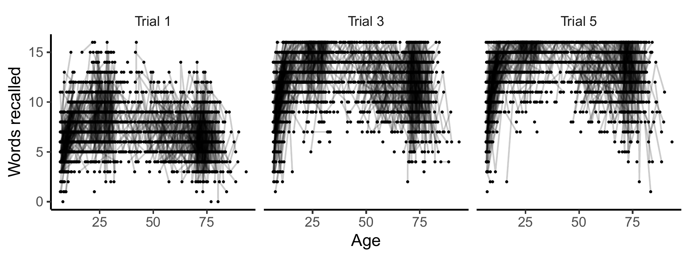
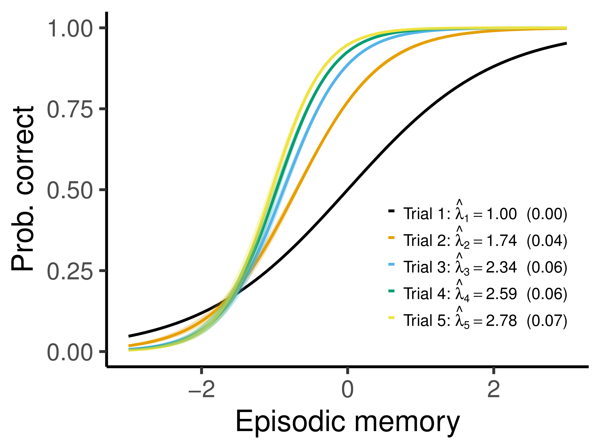
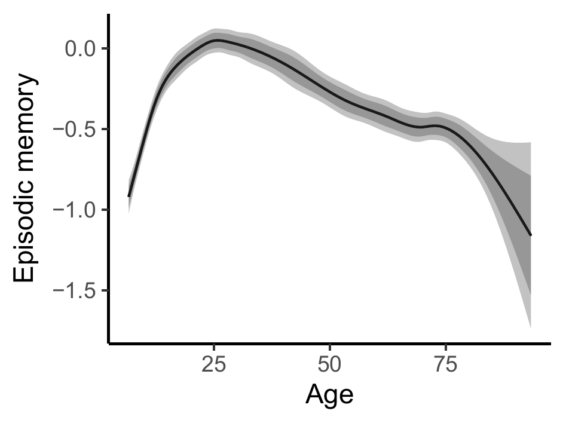
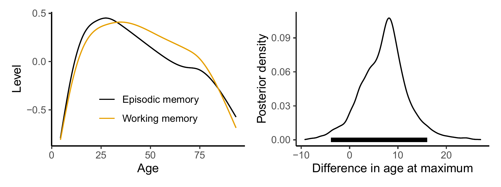
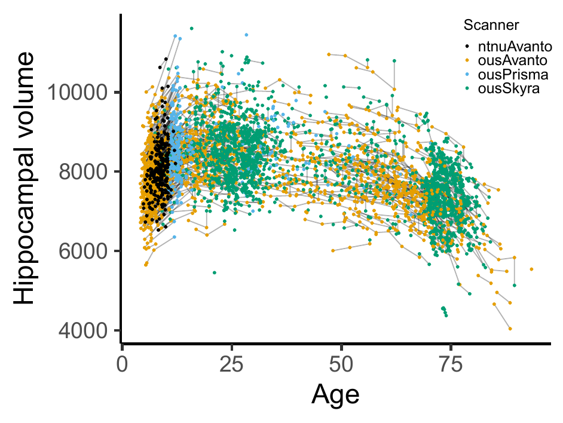
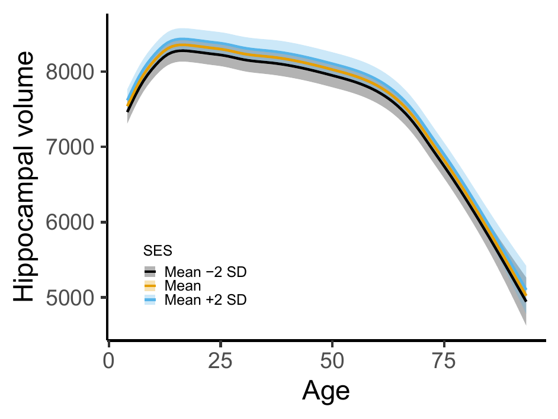

class: inverse, middle, center

# Motivation

---

# Latent Variable Models

In psychology and social sciences, variables of interest are often measured with multiple *items*.

For example

- In psychometrics, latent abilities like working memory or executive function are defined by the response to multiple tasks.

- Surveys often use multiple questions to define a respondent's attitudes towards a given topic.

Classical tools for analyzing such data include factor analysis, item response theory, and structural equation models.

---

class: inverse, middle, center

# Motivating Example

---

# Episodic Memory

California verbal learning test: 

  - 16 words read out loud. Participant asked to repeat back.
  

---

# Episodic Memory

- Ability to recall words depends nonlinearly on age.

- Ceiling effects. Later trials are easier.

- Repeated measurements. Five trials completed at each timepoint.

---

# Episodic Memory

Research question:

  - How does episodic memory vary across the lifespan? Where is the peak, maximum increase, maximum decline?
  
  - How does the lifespan trajectory interact with variables like genetics, brain structure, socioeconomic status?

---

class: inverse, middle, center

# Generalized Additive Latent and Mixed Models

---

# General Framework

- A combination of generalized additive mixed models1 and generalized linear latent and mixed models2.

- Multilevel models with components varying at $L$ levels. $\boldsymbol{\eta}^{(l)}$ denotes a vector of latent variables varying at level $l$, and the vector of all latent variables belonging to a given level-2 unit is

$$\boldsymbol{\eta}_{j} = 
\begin{bmatrix}
\boldsymbol{\eta}_{jk\dots z}^{(2)}{}^{'},
\boldsymbol{\eta}_{k\dots z}^{(3)}{}^{'},
\dots,
\boldsymbol{\eta}_{z}^{(L)}{}^{'}
\end{bmatrix}'$$

- More details in the paper3.

.footnote[[1] For an introduction, see [Wood (2017), Generalized Additive Models](https://www.taylorfrancis.com/books/mono/10.1201/9781315370279/generalized-additive-models-simon-wood). 
[2] [Skrondal and Rabe-Hesketh (2004), Generalized Latent Variable Modeling](https://www.taylorfrancis.com/books/mono/10.1201/9780203489437/generalized-latent-variable-modeling-anders-skrondal-sophia-rabe-hesketh). 
[3] [Sørensen, Fjell, and Walhovd (2021), arXiv preprint](https://arxiv.org/abs/2105.02488)
.]

---

# Part 1: Response Distribution

Response distributed according to exponential family.

$$f\left(y_{i} | \theta_{i}, \phi\right) = \exp\left\{\frac{y_{i}\theta_{i} - b\left(\theta_{i}\right)}{\phi} + c\left(y_{i}, \phi\right)  \right\}$$

Elementary units of observation indexed by $i$, e.g., a single trial in the California verbal learning test shown previously.

Link function may vary with index $i$.

---

# Part 2: Measurement Model

Linking the observed responses to latent variables $\eta_{m}^{(l)}$ of interest.

$$\nu_{i} = \sum_{s=1}^{S} f_{s}\left(\mathbf{x}_{i}\right) + \sum_{l=2}^{L}\sum_{m=1}^{M_{l}} \eta_{m}^{(l)} \mathbf{z}^{(l)}_{mi}{}^{'}\boldsymbol{\lambda}_{m}^{(l)}$$

Hierarchical model with $L$ levels. Each level $l$ has $M_{l}$ latent variables. Factor loadings $\boldsymbol{\lambda}_{m}^{(l)}$ link the latent variables to the observed measurements.

Smooth functions $f_{s}(\cdot)$, e.g., 

$$f_{s}\left(\mathbf{x}_{i}\right) = \sum_{k=1}^{B_{s}} \omega_{ks} b_{ks}\left(\mathbf{x}_{i}\right), ~ s=1, \dots, S.$$

---

# Part 3: Structural Model

Structural model

$$\boldsymbol{\eta}_{j} = \mathbf{B}\boldsymbol{\eta}_{j} + \mathbf{h}\left(\mathbf{w}_{j}\right)+ \boldsymbol{\zeta}_{j}$$

$\mathbf{B}$ contains regression coefficients between latent variables.

$\mathbf{h}\left(\mathbf{w}_{j}\right)$ are smooth functions describing how the latent variables depend on explanatory variables.

$$\mathbf{h}\left(\mathbf{w}_{j}\right) = 
\begin{bmatrix}
\mathbf{h}_{2}\left\{\mathbf{w}_{j}^{(2+)}\right\} \\
\mathbf{h}_{3}\left\{\mathbf{w}_{j}^{(3+)}\right\} \\
\vdots \\
\mathbf{h}_{L}\left\{\mathbf{w}_{j}^{(L)}\right\} 
\end{bmatrix};
~
\mathbf{h}_{l}\left\{\mathbf{w}_{j}^{(l+)}\right\} = 
\begin{bmatrix}
h_{l1}\left\{\mathbf{w}_{j}^{(l+)}\right\} \\
h_{l2}\left\{\mathbf{w}_{j}^{(l+)}\right\} \\
\vdots \\
h_{l,M_{l}}\left\{\mathbf{w}_{j}^{(l+)}\right\}
\end{bmatrix}$$

---

# What's new?

- The functions $f_{s}\left(\mathbf{x}_{i}\right)$ in the measurement model and $\mathbf{h}\left(\mathbf{w}_{j}\right)$ are completely arbitrary. We typically assume that they are linear combinations of certain basis functions, subject to a smoothing penalty. 

- Allows flexible nonlinear modeling without requiring the parametric form to be a priori specified.

- Some Bayesian developments along these lines have been proposed, but all restricted to only two levels. With this framework, an arbitrary number of levels is allowed, as well as crossed random effects.

---

# Mixed Model Representation

- Assume the smooth functions are subject penalization. 

- For example, second derivative penalization amounts to adding terms of the form $\gamma^{f}_{s} \int f_{s}''(\mathbf{u})^{2}\text{d}\mathbf{u}$ and $\gamma^{h}_{lm} \int h_{lm}''(\mathbf{u})^{2}\text{d}\mathbf{u}$ to the log-likelihood.

- This type of penalized spline problem can be represented as a mixed model1. The part of the smooth functions in the penalty nullspace are fixed effects, and the part in the penalty range space are random effects.

- The proposed generalized additive latent and mixed models can be shown to be equivalent to nonlinear mixed models, with a number of parameter constraints.

.footnote[[1] Dating back to [Kimeldorf and Wahba (1970)](https://projecteuclid.org/journals/annals-of-mathematical-statistics/volume-41/issue-2/A-Correspondence-Between-Bayesian-Estimation-on-Stochastic-Processes-and-Smoothing/10.1214/aoms/1177697089.full).]

---

# Profile Likelihood Estimation

- Efficient software available for fitting generalized additive mixed models: `gamm4`, `mgcv`.

- Idea1: Split the parameter space in two. 

  - $\Theta_{1}$ containing factor loadings and regression coefficients between latent variables.
  
  - $\Theta_{2}$ containing spline coefficients, variance components, parametric regression coefficients.
  
- Profile likelihood algorithm:
  1. Estimate $\hat{\Theta}_{2}(\Theta_{1})$ using existing GAMM software.
  2. Maximize profile likelihood $L\{\Theta_{1}, \hat{\Theta}_{2}(\Theta_{1})\}$.
  
- Asymptotic covariance matrix of $\hat{\Theta}_{1}$ obtained directly from inverse Hessian, while $\hat{\Theta}_{2}$ requires additional computation of Jacobian.

.footnote[[1] Based on [Jeon and Rabe-Hesketh (2012)](https://journals.sagepub.com/doi/10.3102/1076998611417628).]

---

class: inverse, middle, center

# Applications

---

# Episodic Memory

---

# Episodic Memory

Measurement model for elementary unit $i$:

$$\nu_{i} = \underbrace{\mathbf{d}_{ti}'\boldsymbol{\beta}_{t}}_{\text{test version}} + \underbrace{d_{ri}\beta_{r}}_{\text{retest effect}} + \underbrace{\mathbf{d}_{ti}'\boldsymbol{\lambda}}_{\text{factor loading}}\sum_{l=2}^{3} \underbrace{\eta^{(l)}}_{\text{latent level}}$$

Structural model for level-2 unit $j$:

$$\boldsymbol{\eta}_{j} = 
\begin{bmatrix}
\eta_{jk}^{(2)} \\
\eta_{k}^{(3)}
\end{bmatrix} 
= 
\underbrace{
\begin{bmatrix}
h\left(w_{jk}\right) \\
0
\end{bmatrix} 
}_{\text{smooth fun. of age}}
+
\underbrace{
\begin{bmatrix}
\zeta_{jk}^{(2)} \\
\zeta_{k}^{(3)}
\end{bmatrix}}_{\text{random intercepts}}$$

---

# Episodic Memory

Profile likelihood estimation, $\hat{\Theta}_{2}(\Theta_{1})$ amounts to fitting the following GAMM over a grid of $\boldsymbol{\lambda}$ values:

$$\nu_{i} = \mathbf{d}_{ti}'\boldsymbol{\beta}_{t} + d_{ri}\beta_{r} + h\left(w_{jk}\right) \mathbf{d}_{ti}'\boldsymbol{\lambda} + \zeta_{jk}^{(2)}\mathbf{d}_{ti}'\boldsymbol{\lambda} + \zeta_{k}^{(3)} \mathbf{d}_{ti}'\boldsymbol{\lambda}$$
Then find $\hat{\boldsymbol{\lambda}} = \hat{\Theta}_{1}$ as the parameters maximizing the log-likelihood.

---

# Episodic Memory

.pull-left[

Item response curves:

]
.pull-right[

Lifespan trajectory of latent episodic memory:

]

---

# Episodic and Working Memory

Important question in cognitive neuroscience: How is change in cognitive performance correlated across cognitive domains?

We extended the previous model to also include items measuring working memory, and estimated a factor-by-curve model.

---

# Socioeconomic Status and Hippocampus

Hippocampus is a brain region which plays an important role in memory consolidation, and is one of the first regions to be damaged in Alzheimer's disease.

It has been suggested that low socioeconomic status is bad for development of the hippocampus, and hence is a risk factor for dementia.

---

# Socioeconomic Status and Hippocampus

We defined socioeconomic status (SES) as a latent variable constructed by

- For kids: Mother's and father's income and education level.

- For adults: Participant's own income and education level.

Latent covariate model, $y_{i}$ contains both income, education, and hippocampus volume:

$$y_{i} = \mathbf{d}_{\text{s},i}'\boldsymbol{\beta}_{\text{s}} + d_{h,i}\left\{ \mathbf{x}_{\text{h},i}' \boldsymbol{\beta}_{\text{h}} + f\left(a_{i}\right)\right\} +  \eta_{1}^{(2)} \mathbf{z}_{i}' \boldsymbol{\lambda}_{1} + d_{\text{h},i} \eta_{2}^{(2)} + \epsilon_{i}$$
Main targets of inference are two terms in vector $\boldsymbol{\lambda}_{1}$: 

  - Offset effect of SES on hippocampal volume.
  
  - Linear interaction effect of SES on hippocampal volume.

---

# Socioeconomic Status and Hippocampus

We did not find much of an effect here:

---

class: inverse, middle, center

# Summary

---

# Summary

- Generalized additive latent and mixed models allow multilevel latent variable modeling when the latent variables themselves depends smoothly on one or more observed covariates.

- Typical applications in longitudinal and spatial modeling.

- Profile likelihood algorithm allows use of existing GAMM software. An R package implementing the method is available from https://github.com/LCBC-UiO/galamm

- Extensive simulations suggest that asymptotic covariance matrices are highly accurate with moderate sample sizes.

- All the details in preprint: https://arxiv.org/abs/2105.02488

---

class: center, middle

# Thanks!

These slides are available at http://osorensen.rbind.io/.

Created via the R package [**xaringan**](https://github.com/yihui/xaringan).

