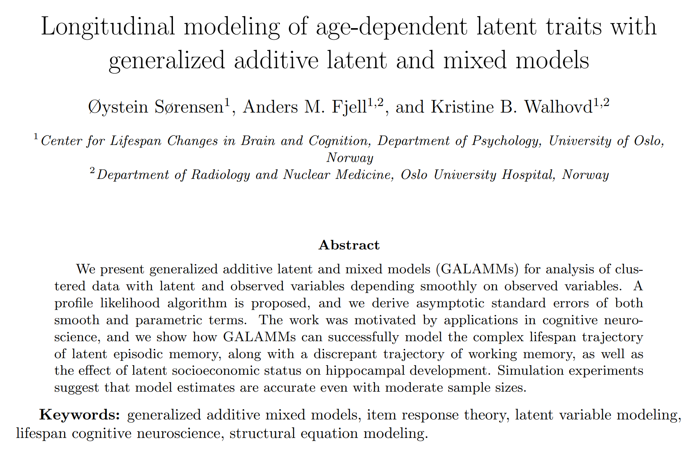
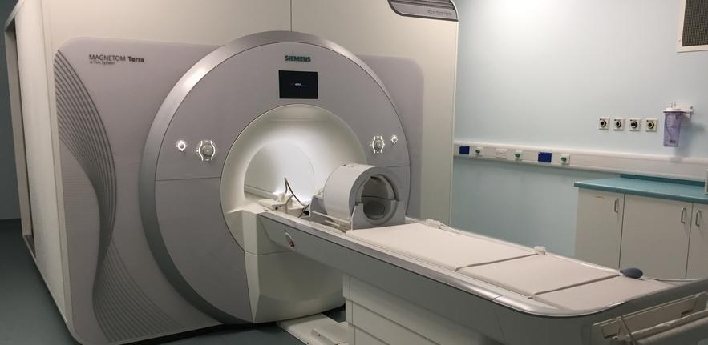
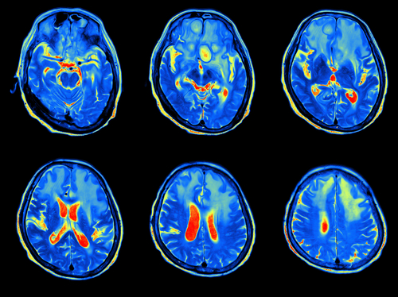

class: inverse, middle, center

# Introduction

---



.footnote[https://arxiv.org/abs/2105.02488]

---

# Latent Variable Models

Multiple observations measure a latent trait, e.g.

- Cognitive abilities follow from responses to different tests.

- Attitudes measured by responses to survey questions.

Classical tools

  - Factor analysis
  
  - Item response theory
  
  - Structural equation models.


---

# Semiparametric Latent Variable Models

Example: California verbal learning test of episodic memory

  - Five trials at a single test session.
  
  - Latent episodic memory seems to depend smoothly on age.
  

<center>

</center>

Question: How does latent episodic memory vary across the lifespan?

---

class: inverse, middle, center

# Generalized Additive Latent and Mixed Models


---

# General Framework

- A combination of generalized additive mixed models<sup>1</sup> and generalized linear latent and mixed models<sup>2</sup>.

- Multilevel models with components varying at $L$ levels. $\boldsymbol{\eta}^{(l)}$ denotes a vector of latent variables varying at level $l$, and the vector of all latent variables belonging to a given level-2 unit is

$$\boldsymbol{\eta}_{j} = 
\begin{bmatrix}
\boldsymbol{\eta}_{jk\dots z}^{(2)}{}^{'},
\boldsymbol{\eta}_{k\dots z}^{(3)}{}^{'},
\dots,
\boldsymbol{\eta}_{z}^{(L)}{}^{'}
\end{bmatrix}'$$


.footnote[[1] For an introduction, see [Wood (2017), Generalized Additive Models](https://www.taylorfrancis.com/books/mono/10.1201/9781315370279/generalized-additive-models-simon-wood).<br>
[2] [Skrondal and Rabe-Hesketh (2004), Generalized Latent Variable Modeling](https://www.taylorfrancis.com/books/mono/10.1201/9780203489437/generalized-latent-variable-modeling-anders-skrondal-sophia-rabe-hesketh).]

---

# Part 1: Response Distribution

Elementary units of observation distributed according to an exponential family.

$$f\left(y_{i} | \theta_{i}, \phi\right) = \exp\left\{\frac{y_{i}\theta_{i} - b\left(\theta_{i}\right)}{\phi} + c\left(y_{i}, \phi\right)  \right\}$$


All responses are stacked in the vector $\mathbf{y} = (y_{1}, y_{2}, \dots, y_{n})'$. Often the responses can be of completely different types, so dummy variables are used extensively in the regression models.


---

# Part 2: Measurement Model

Linking the observed responses to latent variables $\eta_{m}^{(l)}$ of interest.

$$\nu_{i} = \sum_{s=1}^{S} f_{s}\left(\mathbf{x}_{i}\right) + \sum_{l=2}^{L}\sum_{m=1}^{M_{l}} \eta_{m}^{(l)} \mathbf{z}^{(l)}_{mi}{}^{'}\boldsymbol{\lambda}_{m}^{(l)}$$

- Hierarchical model with $L$ levels. Each level $l$ has $M_{l}$ latent variables. Factor loadings $\boldsymbol{\lambda}_{m}^{(l)}$ link the latent variables to the observed measurements.

- Related to confirmatory factor analysis: $\mathbf{y} = \boldsymbol{\Lambda}\boldsymbol{\eta}$.

--

Smooth functions $f_{s}(\cdot)$, e.g., 

$$f_{s}\left(\mathbf{x}_{i}\right) = \sum_{k=1}^{B_{s}} \omega_{ks} b_{ks}\left(\mathbf{x}_{i}\right), ~ s=1, \dots, S.$$

with weights $\omega_{ks}$ constrained by some smoothing penalty.


---

# Part 3: Structural Model

Structural model

$$\boldsymbol{\eta}_{j} = \mathbf{B}\boldsymbol{\eta}_{j} + \mathbf{h}\left(\mathbf{w}_{j}\right)+ \boldsymbol{\zeta}_{j}$$

- $\mathbf{B}$ contains regression coefficients between latent variables.

- $\mathbf{h}\left(\mathbf{w}_{j}\right)$ are smooth functions describing how the latent variables depend on explanatory variables.

$$\mathbf{h}\left(\mathbf{w}_{j}\right) = 
\begin{bmatrix}
\mathbf{h}_{2}\left\{\mathbf{w}_{j}^{(2+)}\right\} \\
\vdots \\
\mathbf{h}_{L}\left\{\mathbf{w}_{j}^{(L)}\right\} 
\end{bmatrix};
~
\mathbf{h}_{l}\left\{\mathbf{w}_{j}^{(l+)}\right\} = 
\begin{bmatrix}
h_{l1}\left\{\mathbf{w}_{j}^{(l+)}\right\} \\
\vdots \\
h_{l,M_{l}}\left\{\mathbf{w}_{j}^{(l+)}\right\}
\end{bmatrix}$$

- Related to structural equation models: $\boldsymbol{\eta} = \mathbf{B}\boldsymbol{\eta} +\boldsymbol{\Gamma}\mathbf{w}+ \boldsymbol{\zeta}$.

---

# What's new?

- The functions $f_{s}\left(\mathbf{x}_{i}\right)$ in the measurement model and $\mathbf{h}\left(\mathbf{w}_{j}\right)$ in the structural model are arbitrary.

- Allows flexible nonlinear modeling without requiring the parametric form to be a priori specified.

- Some Bayesian developments along these lines have been proposed, but all restricted to only two levels. With our framework, an arbitrary number of levels is allowed, as well as crossed random effects.


---

# Mixed Model Representation

- Assume the smooth functions are subject penalization. 

- For example, second derivative penalization amounts to adding terms of the form $\gamma^{f}_{s} \int f_{s}''(\mathbf{u})^{2}\text{d}\mathbf{u}$ and $\gamma^{h}_{lm} \int h_{lm}''(\mathbf{u})^{2}\text{d}\mathbf{u}$ to the log-likelihood.

- This type of penalized spline problem can be represented as a mixed model<sup>1</sup>. The part of the smooth functions in the penalty nullspace are fixed effects, and the part in the penalty range space are random effects.

- We develop a recipe for transforming the proposed models to nonlinear mixed models.

.footnote[[1] Dating back to [Kimeldorf and Wahba (1970)](https://projecteuclid.org/journals/annals-of-mathematical-statistics/volume-41/issue-2/A-Correspondence-Between-Bayesian-Estimation-on-Stochastic-Processes-and-Smoothing/10.1214/aoms/1177697089.full).]


---

# Profile Likelihood Estimation

- With longitudinal data for thousands of participants, random effect matrices are **really sparse**. Implementations must take care of this, or else they'll multiply zeros forever.

- But we can utilize existing software:

  - `gamm4`, running on top of `lme4` 
  
  - `mgcv`, running on top of `nlme`


---

# Profile Likelihood Estimation

- Idea<sup>1</sup>: Split the parameter space in two. 

  - $\Theta_{1}$ containing factor loadings and regression coefficients between latent variables.
  
  - $\Theta_{2}$ containing spline coefficients, variance components, parametric regression coefficients.
  
- Profile likelihood algorithm:
  1. Estimate $\hat{\Theta}_{2}(\Theta_{1})$ using existing GAMM software.
  2. Maximize profile likelihood $L\{\Theta_{1}, \hat{\Theta}_{2}(\Theta_{1})\}$.
  
- Asymptotic covariance matrix of $\left(\hat{\Theta}_{1}, \hat{\Theta}_{2}\right)$ follow from known results.

.footnote[[1] Based on [Jeon and Rabe-Hesketh (2012)](https://journals.sagepub.com/doi/10.3102/1076998611417628).]

---

# Profile Likelihood Estimation

Core of the algorithm, in R

```{r, eval=FALSE}
optim(lambda_init, function(lambda){
  dat$weight <- lambda[dat$item] # update factor loadings
  
  # fit generalized additive mixed model
  mod <- gamm4(
    formula = formula, random = random, 
    start = gammstart, data = dat
  )
  
  # return negative loglikelihood
  -as.numeric(logLik(mod$mer))
  }, 
  method = "L-BFGS-B", # quasi-Newton method
  hessian = TRUE # needed for covariance matrix
  )
```


---

class: inverse, middle, center

# Applications


---

# Episodic Memory


---

# Episodic Memory

Measurement model for elementary unit $i$:

$$\nu_{i} = \underbrace{\mathbf{d}_{ti}'\boldsymbol{\beta}_{t}}_{\text{test version}} + \underbrace{d_{ri}\beta_{r}}_{\text{retest effect}} + \underbrace{\mathbf{d}_{ti}'\boldsymbol{\lambda}}_{\text{factor loading}}\sum_{l=2}^{3} \underbrace{\eta^{(l)}}_{\text{latent level}}$$

In words:


- Linear predictor for the probability of answering correctly on the test is a function of some covariates as well as the true latent level of episodic memory.


---

# Episodic Memory


Structural model for level-2 unit $j$:

$$\boldsymbol{\eta}_{j} = 
\begin{bmatrix}
\eta_{jk}^{(2)} \\
\eta_{k}^{(3)}
\end{bmatrix} 
= 
\underbrace{
\begin{bmatrix}
h\left(w_{jk}\right) \\
0
\end{bmatrix} 
}_{\text{smooth fun. of age}}
+
\underbrace{
\begin{bmatrix}
\zeta_{jk}^{(2)} \\
\zeta_{k}^{(3)}
\end{bmatrix}}_{\text{random intercepts}}$$

For a given participant:

- $\eta_{jk}^{(2)}$ is the latent level of episodic memory at a given timepoint. It consists of a smooth function of age and a random intercept across tests at the given timepoint.

- $\eta_{k}^{(3)}$ is the random intercept of episodic memory across timepoints.

---

# Episodic Memory

By plugging the structural model into the measurement model we obtain the reduced form

$$\nu_{i} = \mathbf{d}_{ti}'\boldsymbol{\beta}_{t} + d_{ri}\beta_{r} + h\left(w_{jk}\right) \mathbf{d}_{ti}'\boldsymbol{\lambda} + \zeta_{jk}^{(2)}\mathbf{d}_{ti}'\boldsymbol{\lambda} + \zeta_{k}^{(3)} \mathbf{d}_{ti}'\boldsymbol{\lambda}$$

At fixed $\Theta_{1}=\boldsymbol{\lambda}$, this is a generalized additive mixed model. Profile likelihood estimation exploits this by using GAMM software to fit $\hat{\Theta}_{2}(\Theta_{1})$ over a range of $\boldsymbol{\lambda}$ values.


Then find $\hat{\boldsymbol{\lambda}} = \hat{\Theta}_{1}$ as the parameters maximizing the profile log-likelihood, and we have estimates of all parameters.


---

# Episodic Memory

Some results, based on 3470 timepoints for 1850 participants between 6 and 93 years of age.

.pull-left[

Item response curves


]
.pull-right[

Lifespan trajectory


Shaded regions are 95% pointwise and simultaneous confidence intervals.

]

---

# Episodic and Working Memory

Important question in cognitive neuroscience: 

- How is change in cognitive performance correlated across cognitive domains?

---

# Episodic and Working Memory

We extended the previous model to also include items measuring working memory, and estimated a factor-by-curve model.


$$\nu_{i} = \mathbf{d}_{ti}'\boldsymbol{\beta}_{t} + \mathbf{d}_{ri}'\boldsymbol{\beta}_{r} + \sum_{l=2}^{3} \sum_{m=1}^{2} \mathbf{d}_{ti}'\boldsymbol{\lambda}_{m} \eta_{m}^{(l)}$$

$$\boldsymbol{\eta} = 
\begin{bmatrix}
\eta_{1}^{(2)} \\
\eta_{2}^{(2)} \\
\eta_{1}^{(3)} \\
\eta_{2}^{(3)}
\end{bmatrix} 
= 
\begin{bmatrix}
h_{1}\left(w\right) \\
h_{2}\left(w\right) \\
0 \\
0
\end{bmatrix} 
+
\begin{bmatrix}
\zeta_{1}^{(2)} \\
\zeta_{2}^{(2)} \\
\zeta_{1}^{(3)} \\
\zeta_{2}^{(3)}
\end{bmatrix}$$

Still three levels, but now two latent variables at each level. Since episodic and working memory are closely related, we assumed a common smoothing parameter for $h_{1}(w)$ and $h_{2}(w)$.

---

# Episodic and Working Memory

Some results. Density plot (right) obtained with empirical Bayes posterior sampling.


The estimated correlation between random intercepts, $\text{cor}\left\{\zeta_{1}^{(3)}, \zeta_{2}^{(3)}\right\}$, was 0.41. Hence, people's episodic memory and working memory are positively correlated.

---

class: inverse, middle, center

# Another Application

---

# Socioeconomic Status and Hippocampus

- Hippocampus is a brain region which plays an important role in memory consolidation, and is one of the first regions to be damaged in Alzheimer's disease. 

- It has been suggested that low socioeconomic status is bad for development of the hippocampus, and hence is a risk factor for dementia.

.pull-left[
  
]
.pull-right[
  
]


---

# Socioeconomic Status and Hippocampus

Data from 4196 MRI scans of 1886 participants.

<center>

</center>


---

# Socioeconomic Status and Hippocampus

We defined socioeconomic status (SES) as a latent variable constructed by

- For kids: Mother's and father's income and education level.

- For adults: Participant's own income and education level.

---

# Socioeconomic Status and Hippocampus

Latent covariate model, with response $y_{i}$ constructed by stacking income, education, and hippocampal volume:


$$y_{i} = \mathbf{d}_{\text{s},i}'\boldsymbol{\beta}_{\text{s}} + d_{h,i}\left\{ \mathbf{x}_{\text{h},i}' \boldsymbol{\beta}_{\text{h}} + f\left(a_{i}\right)\right\} +  \eta_{1}^{(2)} \mathbf{z}_{i}' \boldsymbol{\lambda} + d_{\text{h},i} \eta_{2}^{(2)} + \epsilon_{i}$$

--

Research question:

  - How does socioeconomic status $\eta_{1}^{(2)}$ interact with the lifespan hippocampal trajectory $f(a_{i})$?
  
--
  
Solution:

  - Through dummy variables, when elementary unit $i$ represents a hippocampal volume, $\mathbf{z}_{i}'\boldsymbol{\lambda} = \lambda_{7} + a_{i}\lambda_{8}$, where $a_{i}$ is the age at that timepoint.
  
  - Thus, $\lambda_{7}$ is the offset effect of SES on hippocampal volume and $\lambda_{8}$ is the linear interaction between age and SES.

---

# Socioeconomic Status and Hippocampus

Conclusion:

- 95% CIs for both the offset effect and the interaction effect contained zero. Hence, not much evidence for an effect of socioeconomic status on hippocampal volume in these data.

<center>

</center>

---


class: inverse, middle, center

# Summary

---

# Summary

- Generalized additive latent and mixed models allow multilevel latent variable modeling when the latent variables themselves depends smoothly on one or more observed covariates.

- Typical applications in longitudinal and spatial modeling.

- Profile likelihood algorithm allows use of existing GAMM software. An R package implementing the method is available from https://github.com/LCBC-UiO/galamm

- Extensive simulations suggest that asymptotic covariance matrices are highly accurate with moderate sample sizes.

- All the details in preprint: https://arxiv.org/abs/2105.02488

---

class: center, middle

# Thanks!

These slides are available at https://osorensen.rbind.io/.

Created via the R package [xaringan](https://github.com/yihui/xaringan).

